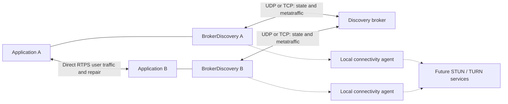

# Centralized discovery broker for zzdds

Status: consolidated design baseline, 2026-09-24; not a wire freeze. Start with the
[implementer guide](broker-spec-guide.md) for controlling contracts and reading order,
and the [closure ledger](broker-spec-closure.md) for compatibility gates. MUST/SHOULD/MAY
express requirements of this proposed zzdds protocol, not new OMG requirements.
The overview below is complemented by the linked detailed contracts. No working broker,
production concurrency migration or frozen generated ABI is claimed. See the
[final handoff](specification-handoff.md) for completion scope and implementation gates.

## 1. Decision

Implement an opt-in **broker discovery service association** and a separate **zzdds discovery broker** executable. Broker-only is a configuration preset; ordinary directed and multicast discovery may coexist with it. The broker distributes participant and endpoint state; applications exchange user data directly. Both UDP and TCP client connections use zzdds transports and the same discovery semantics. Discovery transport selection is independent of user-data transport selection.

Use an explicitly versioned alternative participant/endpoint discovery protocol, with the existing SPDP/SEDP serialized discovery data as its authoritative payload. The broker owns its delivery streams; original participants own the advertised entities. Never impersonate an origin's SEDP writer to make cached discovery look like an ordinary peer transmission.

Keep native metatraffic participant-to-participant in v1: broker discovery supplies the information needed to associate WLP endpoints, while WLP messages use direct reachable transports. Allocated opaque transport relays are a later capability; see the [accepted relay direction](broker-relay-direction.md).

There are two discovery profiles:

| Profile | Behavior | Initial scope |
| --- | --- | --- |
| `cached` | Broker retains origin-owned SPDP/SEDP payloads and distributes state through independent reliable streams. Clients trust broker discovery assertions. | Required in v1 |
| `opaque_peer` | Broker introduces participants; native peer exchanges use direct or future allocated relay transports; secure discovery is validated by the actual peers. No broker interpretation of encrypted endpoint discovery. | Reserved architecture; implement with DDS Security |

This distinction is essential: preserving a ParameterList is useful extensibility, but it does not make a plaintext cache a transparent DDS Security intermediary.

## 2. Standards boundary and prior art

RTPS 2.5 §8.5.6 explicitly permits alternative discovery protocols, including central lookup services, while requiring implementations to support SPDP/SEDP for interoperability. Section 9 specifies the UDP/IP mapping; this document does not claim that zzdds's TCP framing is an OMG-interoperable TCP protocol. [OMG DDSI-RTPS 2.5](https://www.omg.org/spec/DDSI-RTPS/2.5/PDF).

The baseline references are [DDS 1.4](https://www.omg.org/spec/DDS/1.4), [RTPS 2.5](https://www.omg.org/spec/DDSI-RTPS/2.5), [XTypes 1.3](https://www.omg.org/spec/DDS-XTypes/1.3), and [DDS Security 1.2](https://www.omg.org/spec/DDS-SECURITY/1.2). Preserve DDS entity identity, QoS interpretation, matching, and status behavior in the clients. Broker protocol extensions, routing metadata, tenant isolation, and session leases are zzdds-specific.

Relevant comparisons from the original 2026-09-08 research, retained as design
context rather than a newly verified survey of current vendor offerings:

| System | Useful evidence | Consequence for this proposal |
| --- | --- | --- |
| OpenDDS RtpsRelay | Forwards RTPS across NAT, distinguishes SPDP/SEDP/data traffic, and uses STUN and ICE. Its documented ICE implementation does not use TURN. | Separate traffic classes and candidate gathering by actual socket; do not make data relaying the default. [OpenDDS documentation](https://opendds.readthedocs.io/en/master/devguide/internet_enabled_rtps.html) |
| Fast DDS Discovery Server | Reuses discovery structures, supports TCP and redundant servers, and keeps user data direct. The consulted 3.x documentation distinguishes Pro filtering from unfiltered open-source distribution; older v2 descriptions should not be assumed to describe current editions. | Independent transport configuration and explicit disclosure modes are useful; benchmark rather than assume filtering guarantees. [Referenced documentation](https://fast-dds.docs.eprosima.com/en/3.x/fastdds/discovery/discovery_server.html) |
| RTI Cloud Discovery Service | Centrally forwards participant announcements and preserves domain isolation; documents additional domain tags. | Participant rendezvous is a viable simpler alternative, but by itself does not meet the endpoint-discovery scaling objective. Preserve numeric domain isolation explicitly. [Core concepts](https://community.rti.com/static/documentation/connext-dds/current/doc/manuals/addon_products/cloud_discovery_service/core_concepts.html) |

No wire compatibility with these services is promised. Unmodified third-party DDS participants use the existing SPDP/SEDP path. A broker merely configured as an ordinary initial peer is not sufficient to speak this protocol.

### Alternatives rejected for the primary profile

* **SPDP introductions only:** attractive for maximum native reuse, but SEDP remains peer-to-peer, including its reachability and scaling costs. Retain as a possible compatibility mode.
* **Blind RTPS forwarding only:** valuable for protected peer exchanges, but retains peer reliability state and potentially quadratic traffic. This is the future opaque profile, not the optimized cache.
* **Republish cached SEDP with origin GUIDs and new sequence numbers:** creates ambiguous writer ownership, ACK routing, replay and security behavior. Reject.
* **A fresh topic-name/QoS JSON directory:** loses protocol information and becomes a second implementation of DDS semantics. Reject.
* **A DDS data router:** changes the user-data topology and trust model. Outside the discovery service's initial purpose.

## 3. Scope and invariants

V1 includes a single authoritative broker, UDP and TCP sessions, bounded reliable state distribution, complete late-join synchronization, endpoint disposal, participant expiry, all-domain and conservative topic-based disclosure, direct native WLP integration, authenticated deployment options, metrics, and reconnect recovery. It supports routed networks, VPNs, public addresses, and operator-configured port mappings. Automatic NAT traversal is not a v1 claim.

Required invariants:

1. An application participant's GUID and endpoint GUIDs survive broker reconnects. A new participant process/incarnation uses a new GUID prefix; reconnect is not participant reincarnation.
2. Only the admitted owner may mutate its participant and endpoint state. Broker transport identity and entity ownership are different concepts.
3. Broker streams never inhabit an origin's native SEDP sequence space. A broker acknowledgment does not assert receipt by every remote participant.
4. User-data locators never become broker control locators by inference or rewriting.
5. Participant state is installed before dependent endpoints. Removing a participant removes all its endpoints and associated routes before the participant-lost callback.
6. Delivery replay cannot resurrect a removed entity or refresh a dead participant indefinitely.
7. Broker reachability, participant presence, DDS writer liveliness, and peer-path reachability are separate states.
8. Broker filtering may over-disclose within authorized scope; it MUST NOT suppress a potentially matching endpoint because of incomplete type/QoS knowledge.
9. Limits produce visible errors, bounded retries, or explicit resynchronization. Never silently truncate the discovery graph and report success.
10. Security policy never silently falls back from protected discovery to plaintext cached discovery.

## 4. Logical architecture



The broker has four components with separate resource budgets:

* **Session/admission layer:** binds an authenticated client to a scope and participant; validates return paths and owns connection lifecycle.
* **Discovery store:** immutable origin payloads plus parsed indexes, ownership, entity revisions and tombstones.
* **View distributor:** constructs each client's authorized graph, snapshots and deltas; owns downstream reliability.
* **Native metatraffic integration:** connects broker-installed participants to direct WLP associations and receive/repair paths. No broker forwarding service in v1.

A participant has a discovery-state adapter, shared discovery codecs, normal local DDS matching, and a route resolver. The route resolver separates an advertised peer locator from the currently usable direct or broker-assisted path. Network changes update routes without changing GUIDs or rewriting signed discovery.

The resolver owns route eligibility, provenance and lifetime above locator selection.
For an ordinary direct route it supplies eligible locators to the existing
`LocatorSelector` for preference/fanout selection; it does not introduce a second
competing ranking policy. An established broker Channel uses `sendOnChannel` directly
and bypasses locator ranking. Future nominated connectivity paths constrain the eligible
set; they are not mixed indiscriminately with unvalidated advertised addresses.
`canReach` remains a transport capability filter, not evidence that a peer path works.

The broker's protocol endpoints are internal control entities. They MUST NOT appear as user publishers/subscribers or pollute the application's DDS built-in topic view.

### 4.1 Runtime, scheduling and shutdown

BrokerDiscovery is participant-owned protocol state on the shared runtime. Its admission,
inventory/view commit, matching and teardown transitions serialize through participant
control (or an internal subordinate owner with explicit ordering), not a new dedicated
receive thread. Endpoint-local changes contribute retained records without holding
endpoint rights through broker I/O. The service uses bounded session work and a serialized
commit boundary per scope; this logical ordering does not mandate one thread or a global
mutex for the entire broker.

Both client and server protocol logic MUST support manual and hosted drivers. A particular
transport/protection backend may initially support only some targets, but unavailable
combinations fail explicitly. Reusing today's threaded transport for a bounded prototype
is not evidence of an evented/MCU implementation. No thread per control writer, session
or timer is a protocol requirement. Broker-only configurations cannot silently spawn
workers in a manual-only build.

Transport callbacks borrow their input and must not block. Process under eligible bounded
admission or retain/copy into accounted storage before returning. Queued work retains the
transport, session generation, target and payload lifetime; a Channel value alone is not
a lease. Validate again before commit so an old receive, timer or send completion cannot
mutate a replaced session. Application listeners follow the shared entity/identity/group
contract, including inline eligibility; no store/context rights span their invocation.

Publishing a complete view is an internal discovery-state commit. Queue the resulting
matching/status work only after that commit and preserve dependency ordering. This is
not a promise to synchronously execute every application callback before APPLIED, nor
a globally atomic snapshot of all independently queried DDS entities. A new listener
scheduler must not turn broker callbacks into an exception to normal exclusion.

Reserve cancellation/completion and retirement capacity before accepting work. Fairly
schedule control, state and peer metatraffic with bounded priority; control priority
must not starve state indefinitely. Do not block an origin/store on a slow session.
Lease proofs must be processed by the participant's discovery progress path; a socket
reader or unrelated keepalive thread cannot prove that path is responsive.

Participant close fences local mutations and routes, cancels retry/renewal, and publishes
its cleanup obligation before releasing runtime ownership. Send CLOSE when possible,
but local DDS deletion and runtime retirement MUST NOT wait for remote CLOSED, broker
availability or lease expiry. If notification cannot arrive, the broker's finite lease
removes the remote inventory. A late COMMIT cannot reopen a locally closed participant.
Hosted cleanup, ordinary manual teardown tails and explicitly attached external loops
follow [runtime retirement](runtime-retirement.md) and
[bootstrap](runtime-bootstrap-contract.md); the broker adds no mandatory shutdown API.

## 5. Scope, ownership and data model

Every cache, ownership, inventory, view and recovery key includes
`Scope = (domain_id, domain_tag)` within the configured broker authority. These are the
origin participant's standard domain values, not a broker-local namespace or Partition QoS.
A broker uses a distinct logical service participant per configured scope, sharing runtime
and listening addresses as appropriate. No domain translation or cross-scope graph merging
is supported. See [domain identity](broker-domain-identity.md) and the accepted
[multi-domain service arrangement](broker-multidomain-service.md).

The broker MUST verify any domain value in origin metadata against the admitted domain. A matching DDS domain number alone grants no access. DDS partition QoS remains an endpoint matching input, not an access-control boundary.

| Value | Meaning |
| --- | --- |
| `broker_epoch` | Fresh unpredictable 128-bit value at each non-resumable store lifetime; invalidates prior cursors and delivery streams |
| `participant_guid` | Actual application's DDS participant GUID |
| `incarnation_id` | Random 128-bit registration incarnation, fixed for that participant lifetime; additional stale-session defense, not a substitute for a new GUID after process restart |
| `session_id` | Unpredictable admitted transport-session identifier |
| `owner_generation` | Broker-issued fencing generation; only one generation may publish for an incarnation |
| `entity_key` | Scope, participant incarnation, record kind, entity GUID |
| `origin_revision` | Strictly increasing unsigned 64-bit counter per entity, starting at 1; includes removals |
| `view_generation` | Client-assigned, increasing per session/request; broker invalidation requires a new client request. Resume cursor retains its old baseline identity separately. |
| `delivery_seq` | Contiguous per-client, per-view delivery order; distinct from RTPS writer sequence numbers |

Counters MUST NOT wrap. Exhaustion requires a fresh relevant session/view or entity identity before further writes.

An origin record contains the key, revision, operation (`UPSERT` or `REMOVE`), serialization/profile identifier, original protocol/vendor metadata, raw serialized discovery payload, and needed change metadata (key representation, status information and inline QoS). Preserve an original built-in writer GUID/sequence number when one exists for diagnostics or hybrid deduplication; these are not the broker delivery ordering mechanism.

Use SPDP participant data and SEDP publication/subscription data encoded by shared codecs. Retain the complete owned byte representation, including encapsulation, unknown optional parameters, repeated parameters and padding. Parsed indexes are disposable derivatives. The old flat `QosSnapshot` has already been replaced by typed QoS. Typed projections
still are not a lossless wire representation: do not reconstruct authoritative broker
records from `ParticipantData` or endpoint matching data. The generated PL_CDR codecs
and `discovery/wire_codec.zig` are reusable; retain the original owned bytes alongside
any generated parsed value. Re-encoding preserved unknown fields alone is not proof
of byte-exact original ordering/padding retention. Preserve unknown locator kinds even if this broker cannot use them.

RTPS ParameterLists allow repeated parameters and distinguish ignorable from must-understand unknown parameters. Enforce that distinction when semantically accepting data; preserving bytes does not permit a client to accept semantics it does not understand. [RTPS 2.5 §9.4.2.11](https://www.omg.org/spec/DDSI-RTPS/2.5/PDF).

The store may retain structurally valid opaque payloads without claiming semantic support, provided clients receive the original bytes and the index fails open within the authorized scope. Unsupported required semantics MUST prevent successful installation at a client and produce a diagnostic. Malformed lengths, ambiguous singleton keys, ownership mismatches and contradictory scope data are rejected before commit. Repeated list PIDs are not mistaken for duplicate singleton keys.

Endpoint GUID prefixes MUST belong to the admitted participant. A removal includes an explicit entity key; parsing a disposal payload is not the only way to identify the object. The original dispose/unregister status is retained separately from broker reasons such as lease expiry or loss of view interest.

## 6. Protocol and transport contract

### 6.1 Bootstrap and channels

The [wire contract draft](broker-wire-contract.md) supplies proposed field schemas,
framing/version negotiation, cross-stream assembly, digest and resume rules, with a
[experimental control IDL](schema/broker-control-draft.idl). All named operations have draft body types and a
[provisional registry](broker-wire-registry.md); codec evidence is recorded in the wire
contract. These details remain under protocol review; no numeric assignment or experimental schema is production ABI.

Clients receive a list of broker service addresses out of band. No multicast, SEDP, TypeLookup, or application endpoint match is needed to bootstrap. DNS names resolve to service addresses; the authenticated service identity is independent of the resolved IP.

Use RTPS DATA/DATA_FRAG and RTPS reliability semantics for explicitly configured zzdds
control endpoint pairs. Reuse reusable protocol logic and codecs, not the current
thread-owning `StatefulWriter`/`StatefulReader` lifecycle as a mandatory broker design.
Control streams require runtime-driven timers, bounded history/repair and no send under
owner locks. Extract/adapt the relevant engine rather than add a second proprietary
reliability protocol; existing state machines are not evidence those scale gates pass. Their identities are assigned in a documented zzdds vendor extension namespace at wire freeze, never by reusing standardized SPDP, SEDP, WLP, TypeLookup or Security entity IDs. A minimal bounded bootstrap endpoint pair is known in advance; REGISTER offers fresh client endpoint identities; admission returns fresh broker endpoint identities and capabilities. The [endpoint and feature draft](broker-wire-details.md) specifies directions, provisional vendor IDs and metadata formats. Automatic discovery of these endpoints is unnecessary.

Generate the control payload types with zidl. The envelope has an explicit protocol major/minor, operation kind, required-feature flags, scope, broker epoch, session/owner generation, request identity and bounded body. Its extensibility rules MUST allow unknown optional members while rejecting unknown required features. V1 uses one fixed baseline encoding independent of runtime TypeLookup; the wire draft
proposes a fixed bootstrap frame around XCDR2 mutable envelope/body types, subject to
required/duplicate-field validation and round-trip/version fixtures before wire freeze.

There are two v1 logical channel classes:

| Channel | Delivery | Contents |
| --- | --- | --- |
| Control | Reliable, bounded, highest scheduling priority | Admission, commit results, view boundaries, errors and shutdown |
| State | Reliable, bounded, application snapshot/delta cursors | Origin registrations and downstream views |

Lease challenges use a small expiring control exchange; stale retransmitted responses are never treated as fresh. Native metatraffic uses direct participant transports and is not carried as broker snapshot state. Broker TCP reliability does not establish native writer liveliness.

The same semantic messages operate over UDP and TCP. TCP preserves zzdds's existing four-byte big-endian length framing around transport messages. Do not add a competing stream delimiter. The sender's successful write is not a broker commit. Retain RTPS reliability behavior initially on both transports; optimize redundant TCP repair only after proving equivalent reconnect and history behavior.

### 6.2 Required operations

| Operation | Required semantics |
| --- | --- |
| `SPDP introduction / PATH validation / REGISTER / ACCEPT` | Negotiate version, required capabilities, scope, profile, limits, lease and authenticated return path; establish fencing generation |
| `ORIGIN_BEGIN / RECORD / ORIGIN_END` | Atomically publish a complete participant inventory at a local inventory cut; buffer subsequent mutations |
| `MUTATE / COMMIT / REJECT` | Idempotent single-entity change under active ownership; explicit acceptance or typed rejection |
| `VIEW_REQUEST / SNAPSHOT_BEGIN / RECORD / SNAPSHOT_END` | Complete authorized view at a specified cut, with count and digest |
| `DELTA / APPLIED` | Contiguous changes after the cut and an acknowledgment of successful view installation |
| `RESYNC_REQUIRED` | Invalidate cursor and staged changes; obtain a fresh snapshot |
| `VIEW_SYNC` | Fixed synchronization target for resumed views; does not imply callback completion |
| `PRESENCE_QUERY / PRESENCE_PROOF` | Observer nonce-bound, chunked remaining-lease evidence for the installed view |
| `LEASE_CHALLENGE / LEASE_PROOF` | Correlate fresh evidence to an outstanding nonce and local deadline |
| `CLOSE / CLOSED` | Retract participant inventory and invalidate its routes/session |
| `STATUS / ERROR` | Expose lifecycle, authorization, capacity and unsupported-feature failures |

Request IDs are 128-bit and scoped to session. A repeated accepted mutation with the same entity revision and identical bytes is idempotent. Same revision with different bytes is a protocol conflict: reject and require inventory repair. Lower revisions never overwrite higher revisions. A transport ACK only releases transport history; `COMMIT` means validated and installed in the current broker epoch's store. V1 commit is not disk durability or quorum replication.

Assign independent RTPS sequence spaces to each session's control/state writers. Do not use one global reliable writer whose sequence gaps every filtered client must repair. Coalesce state only before assigning a delivery sequence; after assignment, retain the change until acknowledged or invalidate the view explicitly. Native RTPS GAP cannot stand in for an omitted required view delta. Control framing, RTPS sequence ordering, entity revisions and view cursors each solve a different problem and must not be conflated.

### 6.3 UDP obligations

The client binds a specific local channel before sending its directed SPDP service request. Replies MUST return through the same socket/path, and the broker MUST use the service address contacted by the client as the reply source. Existing address-family support checks are not path validation.

Before address validation, the server stays stateless or strictly bounded and MUST NOT send more bytes than received. Use an expiring integrity-protected return-routability cookie; cookies are not client authentication. Allocate reliable history only after validation/admission. An authenticated packet from a new tuple initiates path validation; it does not immediately redirect queued traffic. Retain the old validated path for a bounded overlap.

Fragment control samples at RTPS level. Start with a configurable conservative maximum UDP payload (proposed 1,200 bytes including protocol/security overhead budgeting); support smaller operator limits and path-MTU adaptation. Avoid reliance on IP fragmentation. Enforce aggregate and per-session reassembly bytes, fragment counts, timeouts, duplicate limits and fair repair scheduling before allocation.

Reliability MUST include paced transmission, RTT-sensitive repair, bounded in-flight bytes, backoff, and an aggregate congestion budget covering all streams to a client. An unlimited HEARTBEAT/NACK retransmission loop is not an acceptable WAN congestion policy. Loss, blocked ICMP and delayed acknowledgments must not trigger unbounded traffic.

A UDP Channel identifies a local socket, not one remote peer. Bind the session to its
validated remote tuple as well as transport lifetime and channel generation. Socket
closure can affect several sessions; a packet on that socket does not authenticate any
of them. Wildcard-bound service sockets must preserve the contacted destination address
as the reply source, or reject that service configuration: socket identity alone does
not establish the source-address requirement on a multihomed host.

### 6.4 TCP obligations

The client initiates the connection; the broker replies over that accepted connection, even when the client's listening locator is unreachable from the broker. Use the implemented `Channel`/`sendOnChannel` transport API; do not redial a
NAT-translated source tuple as though it were a universally reachable listener.

Disable `reuse_connection_by_host` for broker channels. Participants behind one NAT must not share a route simply because their source IP is equal. Demultiplex by authenticated session and ownership, not host alone.

Enforce frame limits before allocation, incomplete-frame deadlines, bounded send queues, connect/write deadlines, and cancellation. A slow receiver MUST NOT block the discovery store or other sessions. Cap state frame sizes so that control work gets scheduling opportunities; TCP byte-stream head-of-line blocking remains a limitation. Separate physical priority connections are an optional later negotiated capability.

On any reconnect, establish or explicitly resume a session before sending mutations. A new TCP connection generation does not establish discovery state consistency by itself.

### 6.5 Channel lifetime and output completion

Correlate a Channel with its owning transport and session binding. Current close
notifications broadcast to registered handlers; ignore unknown/already retired tokens,
and never treat every callback as failure of this session. Invalidate only affected
paths. TCP connection death, UDP socket death and a remote UDP lease timeout are
separate events. Detect stalled paths through broker deadlines even when the OS has
not yet reported a close.

Use a bounded shared ingress dispatcher per service/transport registration, followed
by session demultiplexing. Do not register a receive handler per session against the
current 64-handler cap. Current pointer-shaped tokens rely on retention until transport
close; the evented backend needs safe bounded identity retirement, not an unbounded
UDP socket graveyard or an unchecked pointer plus generation.

The current send API returns `anyerror!void`; it does not supply asynchronous transfer
or completion. Adapt it to the [transport/runtime contract](transport-runtime-contract.md):
not accepted retains producer ownership; accepted pending holds immutable bytes through
exactly one terminal completion; cancellation request alone does not release them.
Preserve TCP partial-frame cursors and datagram boundaries. Local send completion,
RTPS acknowledgment, broker COMMIT and client APPLIED are four distinct boundaries.
An output failure after a store commit cannot turn it into an uncommitted mutation.

## 7. Lifecycle and synchronization

Client states are `DISCONNECTED → CONNECTING → ADMITTED → REGISTERING → SYNCING → READY`; failures lead to `DEGRADED` and bounded retry. `STOPPING → CLOSED` is terminal. Report transport-connected, inventory-committed, view-ready and degraded separately. An empty authorized view can be READY.

### 7.1 Registration

1. Authenticate the session, authorize scope and select the discovery profile.
2. Register participant GUID/incarnation. Serialize conflicts by scope/GUID. A competing connection waits for the old registration to close/expire unless authenticated participant continuity explicitly authorizes replacement. No ownership secret is required for unsecured participants; see [admission policy](broker-admission-protection.md). Replacement fences old connections immediately.
3. Publish participant metadata and a complete endpoint inventory. `ORIGIN_BEGIN/END` identify a consistent cut, item count and digest. Local endpoint mutations after that cut are queued locally and transmitted only after matching inventory COMMIT in v1. See the [inventory barrier and future pipelining design](broker-inventory-barrier.md).
4. Validate and atomically commit the inventory. Do not advertise half of an initial participant inventory as complete. Existing committed inventory remains visible during a valid same-incarnation repair until replacement is complete.
5. Install the requested downstream view and then report READY.

Allow only one inventory transaction per owner generation. Give each transaction a monotonically increasing inventory generation, and include it on every fragment/end marker. A replacement inventory is authoritative for membership: previously committed endpoints absent at its cut are removed. Retain their revision high-water marks, reject fragments from prior transactions, and apply post-cut mutations only after the replacement commits. Inventory completion cannot restore an already closed participant. An interrupted transaction expires without altering the last committed inventory.

For v1, deleting and recreating an endpoint MUST allocate a fresh endpoint GUID. Existing endpoints may change supported mutable attributes using increasing revisions. Local revisions are retained through reconnect. Process restart creates a new participant prefix, so old RTPS writer state cannot be confused with a fresh process.

### 7.2 Snapshot plus deltas

The broker serializes accepted mutations within each scope. A view snapshot is taken at store cut `C`; dependent participant records precede endpoint records. Buffer subsequent applicable changes while streaming the snapshot. `SNAPSHOT_END` includes the cut, record count and SHA-256 digest over the ordered, length-delimited serialized records, independent of packetization.

The client stages the snapshot, validates dependencies and limits, and installs it only when the end marker and digest agree. It reconciles the old and new view in one serialized discovery update, then publishes
dependency-ordered matching/status work under section 4.1. Application callbacks use
the normal listener scheduler; they need not finish before APPLIED. Retained identical GUID/revision records must not cause a lost/found storm. Deltas after `C` use contiguous per-view `delivery_seq`; a gap blocks installation until repaired or a new snapshot is requested.

Client `APPLIED` acknowledges an installed prefix, not a received fragment or incomplete staging buffer. No exactly-once network delivery is promised; logical application is idempotent. There is no global simultaneity guarantee between clients.

Snapshot/delta buffering has byte/time limits. If churn outruns a snapshot, send `RESYNC_REQUIRED`, cancel the attempt and retry with backoff. After a configured retry budget, report capacity failure instead of retrying forever. Readiness MUST NOT be reported for a partial view. Admission may reject a view too large for negotiated client limits.

### 7.3 Deletes and tombstones

An accepted REMOVE advances the entity revision and leaves a tombstone. A participant close atomically closes its ownership and removes dependent state. Delayed upserts, delayed inventory fragments, and expired-session packets cannot
revive it. Registration expiry withdraws broker-backed state but is not terminal
application deletion: a still-live incarnation may re-register through fresh authorized
admission, inventory and proof. Explicit participant CLOSE permanently fences its registration and derived work. Once
all associated session, replay, delivery and runtime obligations retire, the registration
can be forgotten and fresh admission with the same identity is permitted under current
policy. No automatic identity blacklist is required in v1. Confirmed transport disconnect promptly withdraws registration and endpoints; silent failures use finite detection/lease deadlines. Unsecured readmission after withdrawal needs no historical ownership proof. Delayed old-session cleanup must compare session/generation before changing a successor registration.

Keep a per-incarnation high-water record even after an endpoint's payload is reclaimed. Delivery tombstones can be collected after every resumable view has acknowledged beyond the removal or has been invalidated. Bound resumption retention; a cursor older than retention MUST receive a full snapshot. Reclaim incarnation fencing records only once all associated sessions, cursors and accepted replay windows have been invalidated. Do not rely on a guessed network packet lifetime to make GUID reuse safe.

Withdrawal from a filtered view is `VIEW_WITHDRAW`, not an origin DDS dispose. It removes a discovery association when appropriate, but must not fabricate a user-topic dispose/unregister sample.

### 7.4 Broker failure

Connection failure marks discovery DEGRADED immediately but does not immediately erase installed peers. Existing direct data paths can operate while peer presence and writer liveliness remain valid. They are not guaranteed to survive indefinitely: when broker-backed presence expires, normal endpoint teardown applies unless a separately enabled direct presence authority exists.

V1 uses one authoritative service per scope and no merging of independent brokers. Multiple addresses may reach that same authority. An operator-switched replacement has a new epoch; all clients re-register and resynchronize. Every newly admitted session requires a fresh origin inventory. Independently resume
the downstream view only when epoch, ownership continuity, view configuration, retained
client baseline and broker cursor/history all validate. A saved cursor alone is insufficient. On epoch change, stage replacement state and preserve unchanged valid associations where possible; never extend old leases merely because the new broker connected.

Automatic multi-broker availability is a later feature requiring explicit ownership/fencing and partition semantics. An arbitrary ordered list of independent servers is not a correct HA implementation: clients may split into disjoint discovery graphs.

## 8. Presence, liveliness and freshness

Keep these timers distinct:

| Timer | Establishes | Cannot establish |
| --- | --- | --- |
| Transport/session health | Client can communicate with broker | Peer data reachability, writer liveliness |
| Origin registration lease | Broker has recent evidence from the participant's discovery agent | Application writer made progress |
| Observer presence lease | Client has bounded fresh evidence about a remote participant | Unbounded validity of cached state |
| DDS writer/WLP lease | Native liveliness policy is being asserted | Discovery graph completeness |
| Future ICE consent/path timer | Permission and viability of a nominated transport path | DDS ownership or QoS compatibility |

Origin registration renewals must come from the participant discovery agent, not an independent socket reader that can stay responsive while the participant is stalled. Use a server challenge with a nonce and a server-monotonic deadline; a timely valid response establishes an origin deadline no later than challenge-send-time plus the negotiated origin lease. Duplicates do not extend that deadline. Negotiate a renewal period with margin for RTT and scheduling. TCP ACKs, old SPDP bytes and arbitrary endpoint replay do not renew registration.

For cached discovery, the negotiated origin lease MUST NOT exceed a finite participant lease advertised in the preserved SPDP payload. A shortened advertised lease takes effect on the next committed participant update and caps the existing deadline immediately. This keeps the broker's additional freshness mechanism from silently lengthening the participant's declared presence policy. `opaque_peer` also preserves native peer lease processing; broker registration freshness never authorizes bypassing native expiry or security validation.

Observer presence must account for delayed replay without requiring synchronized clocks. V1's reference algorithm is a batched client challenge:

* Client sends nonce `q` at local monotonic time `t0` for its current view generation.
* Broker captures an immutable answer at a named view delivery frontier and returns `q`, entity incarnation/freshness generation, and each visible participant's remaining registration lease `r`, evaluated when producing the proof. This may be chunked but every chunk is tied to `q` and the view generation.
* Client sets that participant's broker-backed deadline to `t0 + r`, never `receive_time + r`. If already elapsed, ignore the proof. A duplicate `q` is not a new challenge. An old generation cannot override a newer removal.
* Proposals for compressed/batched equivalents must preserve this conservative bound. Account for configured monotonic clock-rate tolerance; clocks need no common epoch. Suspend/resume invalidates outstanding proofs unless the clock reliably includes suspend time.

Freshness generations are broker-owned monotonic values within an epoch, advanced on accepted renewals, lease reductions and terminal removal. Include the generation on removal/lease-reduction events; invalidate earlier proofs when either event is installed. Accept a proof only for its requested scope/view/epoch and a currently outstanding nonce. Never reduce an already valid deadline merely because an older proof arrives out of order; take the maximum of valid conservative deadlines unless an authoritative removal or lease reduction imposes an earlier bound. Initial inventory commit requires a fresh origin proof and must leave enough lease margin to complete downstream activation.

The [presence completeness contract](broker-presence-completeness.md) defines explicit unavailable entries, aggregate proof limits, fixed membership and subset fallback. A complete timely answer may account for an inactive participant in the fixed READY target without granting it fresh presence.

State snapshots do not grant fresh presence. New records require an unexpired corresponding proof before activation; proofs cannot activate records absent from the installed authorized view. Broker expiry removes the participant at the broker; observer timers ensure bounded expiry when removals cannot be delivered. A slow client may expire a healthy participant conservatively, which is preferable to reviving a dead one indefinitely.

Proposed defaults are a requested 30-second origin lease (negotiated down to the advertised finite participant lease when smaller), 5-second challenge period, full-jitter reconnect backoff from 250 ms to 30 s, and 60-second bounded cursor retention. These are tunable starting points, not performance evidence. Infinite broker registration leases are rejected in v1 even if a different discovery mode accepts infinite participant leases. Reject timer combinations that cannot accommodate configured RTT/deadline margins.

WLP assertions originate in actual participant WLP processing and travel over direct native paths in v1. The broker never synthesizes AUTOMATIC or MANUAL_BY_PARTICIPANT assertions from its session timer. MANUAL_BY_TOPIC remains governed by the native writer/data path.

## 9. Disclosure and matching

V1 supports:

* `all`: all admitted participants, including zero-endpoint participants, and all their endpoints in the authorized scope. This is the correctness/reference mode and supports discovery inspection tools.
* `topic_candidates`: reveal remote opposite-direction endpoints sharing a local topic name, together with the participant metadata and built-in routes needed to evaluate/use them. Do not filter by type name, type identifier, QoS compatibility, partitions, or transport compatibility in v1.

Default to `all` in v1. Applications explicitly choose `topic_candidates` when partial discovery visibility is acceptable; the configuration example below demonstrates that opt-in.

Topic-only candidate selection intentionally includes incompatible QoS/type candidates so that clients retain matching decisions and incompatible-QoS reporting. Type assignability need not imply identical type names. All local endpoints are uploaded even when no current peer is interested; otherwise two mutually unknown endpoints could wait forever for an interest signal.

When interest expands, deliver retained current records immediately; do not wait for origin reannouncement. When it contracts, issue ordered view withdrawals and maintain participant reference counts until all endpoint, diagnostic and in-flight built-in-service dependencies are released. Pending services have bounded pin durations and are cancelled on participant removal or authorization revocation.

Filtering changes DDS built-in topic visibility: `topic_candidates` is a partial discovery view, explicitly advertised in diagnostics and API documentation. Applications requiring complete participant inventories select `all`. Neither mode claims full visibility across other domain IDs/tags or unavailable brokers.

More aggressive filters require a proof that they introduce no false negatives for the supported DDS/XTypes semantics, including partition expressions, mutable QoS, content-filtered topics and group presentation. Unknown semantics fall back to a broader authorized view. A content-filter expression on user samples is not by itself a safe endpoint discovery filter.

## 10. Built-in services and security evolution

### 10.1 Direct native metatraffic

Broker-installed participant information establishes native WLP associations, using the
advertised capabilities and metatraffic locators. Preserve native message identities,
receive dispatch and reliability/repair paths. SEDP receive plumbing may be shared today,
but broker mode must not require native SEDP discovery exchanges merely to receive WLP.

Both user-data and metatraffic paths must be reachable independently. The broker provides
no forwarding fallback in v1. Native TypeLookup and DDS Security will use direct or later
allocated relay transports when those services are implemented. The [relay direction](broker-relay-direction.md)
defines the extension boundary; do not implement a temporary DDS-specific routing service.

### 10.2 XTypes

XTypes TypeLookup is a request/reply built-in service with four endpoints and reliable, volatile service traffic; carrying `PID_TYPE_INFORMATION` alone does not implement it. [XTypes 1.3 §7.6.3.3](https://www.omg.org/spec/DDS-XTypes/1.3/PDF).

Preserve TypeInformation, TypeIdentifiers and endpoint availability metadata in cached discovery now. Once TypeLookup is implemented, actual participant service endpoints communicate directly or through the metatraffic route. Preserve request identities, related identities, target service identity, minimal/complete distinctions and dependency traversal. The broker does not answer as the origin.

An optional future broker type service must be an explicit service under its own identity. Validate TypeObject/TypeIdentifier consistency and dependencies before caching. Bound object size, dependency depth and cycles; isolate authorization and disclosure by scope. Public hash identity is not permission to reveal a protected type. This service is an optimization, never required to bootstrap the broker protocol.

### 10.3 DDS Security

DDS Security defines stateless authentication endpoints, volatile secure token exchange, and protected discovery endpoints. Its `relay_only` facility has specific cryptographic/access-control semantics; it is not blanket authorization to republish protected discovery. [DDS Security 1.2 §§7.5, 9.4–9.5](https://www.omg.org/spec/DDS-SECURITY/1.2/PDF).

For v1 `cached`, transport/session authentication protects registration and access to the broker, but the broker is trusted to report discovery state. This is not end-to-end DDS discovery authentication. Expose this trust model explicitly.

Future `opaque_peer` requirements:

1. Introduce authorized candidate participants with bootstrap metadata sufficient to run native DDS authentication. Such introductions are untrusted hints until peer validation succeeds; native exchanges use direct paths or a separately implemented allocated relay.
2. Run authentication, permissions checks, secure participant/endpoint discovery and key exchange between actual participants. Install protected state only after native validation; the plaintext cached-state adapter is bypassed for that peer relationship.
3. Any future allocated relay carries entire protected messages without locator substitution, re-signing, impersonation or replay into a new recipient's crypto session. Late join invokes the origin's native discovery history and per-peer security processing.
4. With hidden endpoint metadata, use the whole authorized participant scope as the default candidate set. Do not promise topic-based filtering or its scaling benefit. Optional disclosure hints need a separately agreed confidentiality policy.
5. Keep origin/receiver security identities and receiver-specific protection intact across broker failover. A broker restart may interrupt routing; it cannot generate fresh peer tokens or secure history.
6. Negotiation binds the chosen profile to authenticated configuration. If no supported secure profile exists, fail explicitly. Never strip protection to make discovery succeed.

An opaque router may be unable to verify that encrypted bytes contain only metatraffic. Enforce authenticated class declarations, recipient-side dispatch checks and separate quotas; document that broker-side payload classification is limited under whole-message encryption. Do not advertise cryptographically enforced topic classification without evidence.

This profile preserves a path for future DDS Security reuse but does not establish conformance in advance. Protected discovery, origin authentication, access revocation, native lease behavior and each crypto protection scope require integration tests with the eventual implementation. Optimized secure caching is a separate later design problem, not a v1 promise.

### 10.4 Admission security before DDS Security exists

Support `trusted_network` and `authenticated` deployment policies. The former requires explicit configuration and is suitable for a separately protected network; it cannot be described as safe public-internet discovery.

An authenticated public deployment requires authenticated encryption for broker control sessions over both transports, server identity verification, client credentials and per-scope authorization. Use a maintained TLS implementation for TCP and a maintained DTLS implementation for UDP, integrated as transport/channel protection. Do not design custom cryptography. If these wrappers are deferred, public deployment support is deferred with them; UDP support must not quietly have a weaker trust model than TCP.

Bind the envelope's scope, session, epoch, ownership and negotiation transcript to the protected session. Enforce replay windows, credential rotation, revocation, per-principal quotas and authenticated administrative operations. A return-path cookie alone does not satisfy these requirements. DDS Security remains responsible for eventual end-to-end participant/endpoint permissions.

## 11. Connectivity and NAT traversal

Broker connectivity establishes a control path only. A TCP control connection conveys no UDP data mapping; a UDP control mapping conveys no mapping for another socket. Observed source addresses are path-scoped observations, not replacements for advertised locators.

| Deployment | V1 expected outcome |
| --- | --- |
| Same LAN without multicast | Broker discovery; direct unicast user data |
| Routed subnets / VPN with permitted peer ports | Broker discovery; direct data using routable advertised locators |
| Public or explicitly port-mapped peer listeners | Works when both data and native reply/repair paths are configured correctly |
| Private peers can reach broker but not each other | Discovery succeeds; report direct connectivity unavailable |
| TCP control allowed, UDP data blocked | TCP broker connection does not solve UDP data; use mutually supported reachable data transport |
| Both peers behind restrictive NAT/firewalls | No v1 connectivity guarantee; future ICE may find a path, future TURN may supply fallback |
| Peers support disjoint data transports | No matchable transport path; broker does not translate UDP to TCP user data |

Add a local ConnectivityAgent interface with `gather`, `exchange`, `check`, `nominate`, `invalidate` and `close` operations. Reserve a capability-negotiated connectivity record namespace outside original SPDP/SEDP bytes. A candidate set includes owner incarnation, transport instance/component ID, generation, address family, candidate type, foundation/priority, related address, expiry, and (for TCP) connection role. Credentials are exchanged only with authorized peer candidates and never logged.

A component identifies the actual bound socket or connection role, such as a metatraffic socket or user-data socket. Endpoints sharing a socket may share candidate work; endpoints with different sockets must not inherit its mapping. IPv6 interface scope and overlapping private address spaces require local network context; a raw address string is insufficient.

Use standard [ICE RFC 8445](https://www.rfc-editor.org/info/rfc8445/) with its applicable updates, [STUN RFC 8489](https://www.rfc-editor.org/info/rfc8489/), and [TURN RFC 8656](https://www.rfc-editor.org/rfc/rfc8656.html) when implementing traversal. ICE-TCP is a separate capability described by [RFC 6544](https://www.rfc-editor.org/rfc/rfc6544); it is not implied by a TCP connection to the discovery broker.

Future connectivity policy defaults to `direct_preferred`: authenticated checks and nomination choose working direct paths first. `direct_only` forbids relayed user data; `relay_allowed` authorizes bounded fallback. Do not exhaust an unbounded list of direct candidates before offering fallback: candidate priorities and a configured direct-attempt deadline govern escalation.

The accepted [relay direction](broker-relay-direction.md) makes allocation ownership and peer access lifetimes separate, permits origin-advertised relay locators, and reserves direct-only/direct-preferred/forced-relay policy space. No relay allocation is a v1 capability.

The broker is the candidate signaling rendezvous; STUN/TURN may be separate services or optional colocated components. TURN allocations, credentials, permissions, channel bindings, quotas, refresh and expiry are a separate data-plane service. UDP versus TCP/TLS access to TURN and relayed peer transport are separate negotiated facts. No automatic allocation charged to a user without the configured policy allowing it.

Route nomination updates the local route table, leaving original GUIDs and discovery data intact. Path changes cover both data and RTPS repair/control in both directions. In-flight duplicates remain subject to native RTPS sequence handling. Bound concurrent checks and apply destination policy so a malicious participant cannot use candidate exchange to trigger unrestricted scans of another client's network.

## 12. Performance, limits and operations

Let `N` be participants, `E` total endpoints, `R` delivered endpoint-to-observer relationships and `B` retained raw payload bytes. A single cached broker has approximately `O(B + E + N + R)` state before bounded queues; client-to-broker reliability associations are `O(N)`. Full disclosure still has `O(N·E)` endpoint delivery and potentially `O(N²)` participant presence distribution. Sparse topic interest reduces `R`; all-to-all applications cannot escape their information volume. Opaque peer security can reintroduce `O(N²)` native associations.

Therefore centralization is not an unconditional performance improvement. It trades multicast/peer work for server indexing, fanout, queues and a failure dependency. Include single-host and small-LAN workloads in benchmarks where the broker may lose.

Store raw payloads once with immutable retained ownership (reference counting or an equivalent bounded lifetime mechanism). Index by scope and topic/direction; maintain per-view membership and dependency counts. Snapshot streaming avoids cloning the entire database for each joining client. Batch small records within MTU/frame limits. Use per-client round-robin or deficit scheduling with reserved control capacity and finite repair budgets. No global store lock may be held across network writes or application callbacks.

V1 MUST configure and report bounds for: sessions, participants, endpoints per participant/scope, raw record bytes, view bytes, outstanding mutations, repair history, tombstones, snapshot staging, incomplete inventories, reassembly, accepted unauthenticated work, candidate records, and per-principal egress. Admission accounts for the requested view, not just its ingress record size.

Do not solve a slow observer by blocking all origins. Disconnect or invalidate that observer's cursor with an explicit reason when its retention budget is exhausted. An origin whose mutation cannot be committed retains/retries it or reports discovery failure to its application. Endpoint creation semantics must expose asynchronous announcement failure; local creation success alone cannot promise remote discovery.

The existing TCP implementation uses a receive thread per connection, and current
`StatefulWriter` can spawn a heartbeat thread. A broker session must not mechanically
multiply either lifecycle for every logical control/state endpoint. Reusing it is suitable for a bounded prototype; large-scale support requires an event-driven backend or measured evidence that the thread/memory budget meets the claimed envelope. Preserve the transport interface while changing the backend. Do not market 100,000-client scalability based solely on asymptotic analysis.

Required metrics include admission/authentication failures, active and degraded sessions, participant/endpoint counts, committed-to-applied latency, ready latency, expiry/withdrawal reasons, queue bytes, repair traffic, snapshot retries, cursor invalidations, duplicates/conflicts, route errors, direct-path success, and future relay utilization. Avoid GUID/topic labels in unbounded metric dimensions; use sampled traces with redacted credentials.

Readiness means the broker can admit and serve its configured scopes, not merely that its process listens. Provide graceful drain, administrative scope/credential controls, structured logs, a read-only graph inspection API with authorization, and protocol-version/build reporting. Persistence, federation and consensus HA are later phases; durable files loaded after restart are unconfirmed hints until origin ownership/freshness is re-established.

## 13. Configuration and API contract

The [public API reconciliation](broker-public-api.md) proposes compatibility presets,
independent discovery overrides, bounded configuration and extension status signatures.
The example below uses the current proposed surface; it is not accepted by the
current parser:

```toml
[discovery]
kind = "broker"

[discovery.broker]
addresses = ["tcp://discovery.example.net:7443"]
view = "topic_candidates"
security = "authenticated"
credential_ref = "workload-identity"
startup = "require_ready" # Explicit override; default is allow_degraded.
[discovery.broker.bootstrap]
startup_timeout_ms = 15000

[transport.tcp]
enabled = false # Existing user-data selection: UDP user data in this example.
```

For UDP control, configure `udp://...` service addresses and the authenticated datagram channel. A broker may listen on both UDP and TCP for the same authoritative scope; UDP-connected and TCP-connected clients discover each other. Mixed addresses in one service configuration select a reachable transport to that same authority, not independent graph authorities.

`startup = require_ready` fails participant startup on timeout; `allow_degraded` permits local operation and exposes asynchronous discovery status. Neither silently enables multicast fallback. Expose readiness waiting, broker status, view completeness, registration failure and
peer connectivity diagnostics through zzdds extension interfaces in `idl/zzdds.idl`,
then generate Zig/C and other bindings. Do not add proprietary operations/status bits
to `dcps.idl` or introduce ad hoc language-specific ownership arguments. Preserve existing `spdp` defaults and transport behavior for applications that do not opt in.

Multicast, ordinary directed discovery and configured broker services are independently
selectable; broker-only is a preset, not an exclusive plugin requirement. Broker-installed
peers do not automatically trigger ordinary discovery fan-out. The [coexistence proposal](broker-discovery-coexistence.md)
defines one graph with source-specific evidence and proposes shared origin revisions for
cross-path ordering. The shared graph, source-specific evidence and shared origin-version direction are accepted; wire metadata/equivalence rules are defined in the origin-version contract; production integration remains pending. Automatic LAN import/
export and cross-vendor broker gateways remain outside v1.

### 13.1 Readiness, effects and asynchronous failure

The [accepted readiness contract](broker-readiness-contract.md) selects allow-degraded
startup by default, a recovery-following wait with one deadline, non-resetting status
and optional coalesced notification. A separate registration barrier is deferred.
Same-participant matching and local lifecycle MUST remain independent of broker
connectivity, including before first admission. Data transfer still uses the configured
data path. Broker self-echo/expiry cannot override authoritative local entity state.

The required API separates local DDS creation, origin registration, installed view and
peer data reachability. `READY` means the selected inventory/view synchronization cut
has completed with valid freshness evidence; it does not mean all peers matched, that
listeners have executed, or that every later local mutation is already committed.
Concurrent churn must not require an impossible globally quiet graph. Status carries
session/view generations so observations from a replaced synchronization are recognizable.

Local endpoint creation reserves bounded announcement bookkeeping before publication.
Failure to reserve can fail local creation under its existing constructor convention.
Once the endpoint exists, network rejection/timeout is asynchronous discovery failure,
not retroactive failure of the returned DDS entity or a fabricated DDS dispose. Retain
its pending revision for bounded retry/resync, or report a terminal registration error;
never silently forget it while claiming synchronization of that revision. Close fences
pending announcement work. This does not make local creation remotely transactional.

`require_ready` startup must use one deadline while making permitted internal progress,
withhold usable participant publication until its startup condition succeeds, and cancel
staged startup on failure. No application listener may observe a half-constructed
participant. Rollback cannot rely on a remote CLOSE acknowledgment. `allow_degraded`
publishes local operation with observable discovery state; it does not change normal
DDS writer reliability or provide connectivity that the configured network lacks.

Readiness waiting must preserve callback rights, exclude automatic nested callbacks,
and reject proven self-dependencies under the concurrency contract. Waiting does not
own the runtime indefinitely or restart its deadline on reconnect. Getters must remain
useful to standard applications that configure broker mode but install no zzdds-specific
listener; asynchronous failures also have bounded diagnostics/metrics.

The readiness wait follows recovery across broker session/epoch changes without
restarting its deadline, as specified in the accepted readiness contract. Concrete
public status/error types and generated signatures remain API integration work;
bindings must preserve the selected behavior.
A separate registration barrier, if offered, must name the local revision frontier it
covers; a general READY flag is not a receipt for every endpoint mutation.

## 14. Integration with the current repositories

Reconciliation baseline: local zzdds `d41e540` (broker documents rebased on main
`c37181e`) and zidl `26dc737`, inspected 2026-09-17. These are local audit baselines,
not a claim to have fetched today's remote heads. No production tests were rerun for
this documentation revision. See [main refresh](main-refresh-review.md).

| Existing area | Available now / remaining broker work |
| --- | --- |
| `src/discovery/interface.zig` | Typed QoS replaced flat QosSnapshot. Retain raw-record provenance independently; add transactional view/update integration with explicit callback lifetimes. |
| `src/discovery/spdp.zig`, `sedp.zig`, `wire_codec.zig`, `idl/rtps_discovery.idl` | Generated SPDP/SEDP PL_CDR codecs are implemented. Ordinary SPDP decode projects fields and deinitializes generated data. Broker retention must capture original bytes before projection; validation/fidelity tests still required. Do not schedule another codec extraction. |
| `src/discovery/combined.zig`, `builtin_endpoint.zig`, `wlp.zig` | Feed broker participant state into direct WLP associations; preserve receive dispatch and native repair independently of peer SEDP discovery. Test metatraffic reachability separately from user data. |
| `src/transport/interface.zig`, `udp.zig`, `tcp.zig` | Channel, same-socket UDP replies, accepted-connection TCP replies and close notifications exist. Add broker session validation, bounded retained lifetime and async submission/completion. Test source address as well as socket selection. Current close callbacks broadcast; current pointer tokens require retained transport storage. |
| `src/transport/locator_selector.zig` | Keep direct-locator ranking below route eligibility; established channel sends bypass it. Future connectivity nomination supplies validated route constraints. |
| `src/rtps/writer_sm.zig`, `reader_sm.zig` | Reuse protocol semantics with shared-runtime timers/ownership. Thread multiplication, remaining send-under-lock paths and repair/congestion budgets are integration/scale gates, not a new discovery wire format. |
| `src/dcps/participant.zig`, `src/c_abi/extensions.zig` | The inspected ParticipantStack still owns concrete SpdpSedpDiscovery. Add tagged discovery/stack ownership selected by configuration; separate broker control from data transport and advertised data locators. |
| `idl/zzdds.idl`, `src/config/schema.zig`, generated TOML config | Broker enum is not an implementation. Add real scalar configuration and zzdds extension APIs at the IDL source; regenerate. No environment-variable configuration is introduced. Process-local runtime/resource references follow the construction-only Config contract. |
| zidl control codecs and bindings | Existing discovery codec work is reusable; broker envelope encoding/unknown-member fixtures and control IDL are separate gates. Generic managed-reference Config work remains experimental and must not be mistaken for production binding support. |
| `src/security/*`, `docs/design/security-pipeline.md` | Full DDS Security and authenticated broker transport deployment remain separate implementation gates. No protected-discovery claim follows from preserving bytes. |

Recommended new modules: `discovery/broker_client.zig`, `discovery/state_store.zig`, `connectivity/interface.zig`, and a broker executable backed by a reusable service library. Exact file organization is an implementation choice. Keep protocol/state logic testable without real sockets.

## 15. Verification and release gates

Tests must establish observable behavior, particularly where broker semantics differ from native discovery.

| Area | Required evidence |
| --- | --- |
| Codec fidelity | Little/big-endian input, repeated and unknown optional PIDs, required unknown PIDs, malformed lengths, key-only disposal, nondefault QoS and TypeInformation. Byte-exact raw preservation through broker storage and replay. |
| State ordering | Endpoint before participant, update/delete reordering, duplicate revision conflicts, inventory replacement during mutation, GUID collision, and old-generation traffic. No stale resurrection. |
| Synchronization | Join during continuous churn; drop snapshot end, disconnect mid-snapshot, lose a delta, exhaust cursor retention. READY only for a verified complete view. |
| Failure detection | Process crash, discovery-agent stall, broker crash, one-way loss, delayed lease proofs, duplicate challenges, suspend/resume and clock changes. Bounded expiry; no broker-manufactured writer liveliness. |
| Transport matrix | UDP↔UDP, TCP↔TCP and UDP↔TCP control clients with independent UDP/TCP data choices; IPv4/IPv6; same NAT source IP; return over accepted TCP connection; UDP rebinding. |
| Reliability/resource limits | Loss, duplication, reorder, MTU reduction, fragment floods, slow TCP reader, oversized frame and reconnect storm. Bounded memory and fair progress for healthy sessions. |
| Filtering | Full-view versus candidate-view differential matching; late interest, zero endpoints, partition/QoS mismatch reporting, distinct assignable type names, mutable updates and pending service pins. |
| Direct metatraffic | Broker-installed WLP peers work with peer SPDP/SEDP disabled; native replies/repair use reachable direct paths; blocked metatraffic does not gain false liveliness from broker presence. |
| Security | Cross-domain-ID/tag denial, spoofed owner, expired/revoked credentials, downgrade attempts, unauthenticated amplification, replay and candidate destination abuse. |
| Future XTypes/Security | TypeLookup before endpoint match; protected authentication before secure discovery; each crypto protection scope; secure late join and broker restart. Required before advertising those capabilities. |
| Runtime/lifetime | Same protocol traces under manual and hosted drivers; final-participant deletion from a callback, pending send cancellation, stale channel-close/wake, wrapper failures and external-loop retirement. No per-session thread assumption. |
| Existing interoperability | Native SPDP/SEDP and supported data interoperability remain unchanged when broker mode is disabled. Cross-vendor broker compatibility remains explicitly unsupported. |

Use deterministic fake clocks, memory/lossy transports and model-based event sequences for ownership, snapshots and lease invariants. Fuzz bootstrap, envelope, raw ParameterList, inventory and fragment parsers. Real socket/network-namespace tests are required for NAT/source-port and TCP return-path
claims; in-memory tests cannot establish them. This adds a targeted, explicitly configured
integration-test facility; it does not require adopting a general network simulator or
claiming those tests already exist in CI. Privileged test requirements and skips must be
reported rather than turning missing environment coverage into a pass.

Benchmark native SPDP/SEDP and both broker transports at proposed tiers of 2, 100, 1,000 and 10,000 participants, subject to available hardware. Vary endpoints per participant, interest density, churn, WAN RTT/loss and payload size. Record p50/p95/p99 time from origin commit to installed peer state, startup-ready time, bytes, CPU, peak memory, thread count and recovery convergence. Include full disclosure, candidate filtering and slow observers. Publish hardware/configuration and supported limits; do not impose an unsupported latency number as a design claim.

### Delivery sequence

1. **Protocol foundations:** reuse merged codecs/channels; close the section 16.1 decisions,
   draft control IDL/identifiers and cross-version fixtures, then review wire freeze.
   Validate raw-record fidelity and full-view cached state using fake clocks/in-memory
   channels. Do not repeat the completed general concurrency investigation.
2. **Functional broker:** single broker, UDP/TCP channels, full lifecycle, direct WLP integration, configuration/bindings and routed-network integration tests. Candidate filtering follows full-view differential tests.
3. **Production hardening:** authenticated TCP/UDP deployment, quotas, pacing, backpressure, restart recovery, observability and published scale envelope. These are public-deployment release gates, not optional cleanup.
4. **Direct connectivity assistance:** candidate signaling, socket-specific STUN/ICE, nomination and path migration; implement ICE-TCP separately if needed.
5. **Fallback and availability:** explicit TURN service integration; consensus/fenced HA specification and implementation. Either may be prioritized independently.
6. **OMG extensions:** integrate native TypeLookup and `opaque_peer` DDS Security as those features arrive. They may proceed over direct transports before traversal/HA; native service associations and transport-extension boundaries are preserved from phase 1.

## 16. Remaining decisions and release gates

### 16.1 Specification and wire-freeze decisions

The [implementer guide](broker-spec-guide.md) identifies controlling contracts. Public
behavior and reviewed admission/recovery/lifetime invariants are consolidated. All 27
active operations have draft bodies and a phase/effect table; reserved operations remain
unsupported. Exact bytes and hashes have independent fixtures, not deployed compatibility.

The [closure ledger](broker-spec-closure.md) names the remaining wire-freeze gates:
recipient-specific inline introduction feasibility, path/protection provider contract,
assignment/version review and schema/storage agreement. Generated API integration and
production validation remain separate delivery gates. No new feature investigation is
needed to understand the accepted baseline.

### 16.2 Implementation and deployment gates

* TLS/DTLS provider and Zig/platform integration; maintain authenticated UDP/TCP parity.
  Public authenticated deployment is unavailable until both advertised paths meet policy.
* Broker stream integration over the implemented Channel API: bounded ownership,
  asynchronous completion, same-source UDP replies and runtime-driven reliability.
  The basic channel shape is settled; production adapter behavior still needs evidence.
* Measured memory/record/view limits, timers and supported scale; concrete defaults may
  vary within negotiated protocol limits. These are not unspecified interoperability rules.
* Generated extension bindings, original-byte retention, failure injection, manual/hosted
  execution, target-specific backend coverage and the section 15 integration matrix.

These gates remain mandatory for the corresponding production claims. Completing all
of them is not a prerequisite for writing the remaining protocol specification.

The most consequential future policy decision is whether a deployment trusts the broker with discovery plaintext. `cached` chooses that trust for scaling; `opaque_peer` preserves peer-owned security processing at a potentially substantial discovery cost. Both belong in the architecture, and neither should be presented as providing the other's properties automatically.
